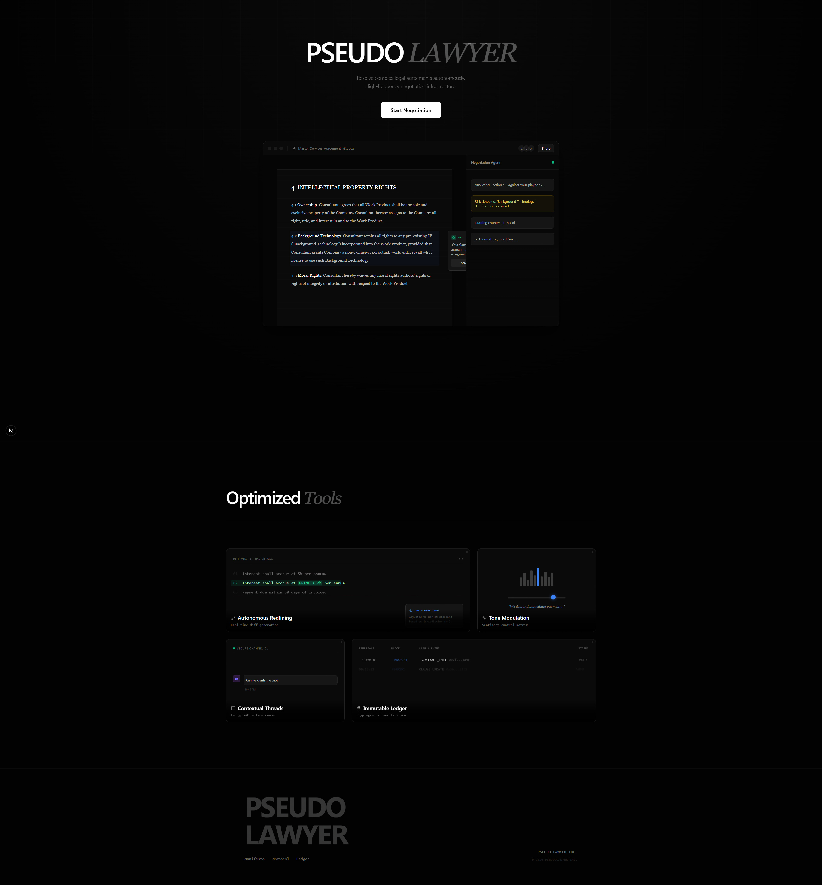

# ⚖️ PseudoLawyer

Forked from unfinished group project, but I finished it on my own.

> **AI-Powered Contract Negotiation Platform**
> *Negotiate smarter, faster, and fairer with Sudo, your AI Mediator.*

PseudoLawyer is a modern web application that transforms the complex, often adversarial process of contract negotiation into a streamlined, collaborative experience. It enables two parties to negotiate real-time with the assistance of **Sudo**, an intelligent AI mediator that helps resolve disputes, draft compromises, and generate professional legal documents.


[Video Demo](https://youtu.be/JdlF04etSWU)

## ✨ Key Features

### 🤝 Real-Time Multi-Party Negotiation
- **Live Group Chat:** Seamless real-time messaging between you and your counterparty.
- **Role-Based Access:** Distinct roles for Initiators (hosts) and Participants (invitees).
- **Secure Architecture:** Built on Supabase for robust authentication and data security.

### 🤖 Sudo: Your AI Mediator
Sudo isn't just a chatbot—it's an active participant in your negotiation.
- **Smart Triggering:** Call Sudo anytime by mentioning **`@Sudo`** or clicking the **✨ Ask Sudo** button.
- **Conflict Resolution:** Sudo analyzes disagreements and suggests fair, middle-ground compromises.
- **Clause Drafting:** Ask Sudo to write specific legal text (e.g., *"Draft a residual clause for 3 years"*).
- **Neutrality:** Designed to balance the interests of both parties, not just the host.

### 📜 Intelligent Contract Generation
- **Context-Aware Drafting:** Sudo reads your *entire negotiation history* to draft the final contract.
- **Professional Formatting:** Generates complete legal documents with proper sections, definitions, and signatures.
- **Instant Download:** Export your finalized agreement as a text document immediately.

### 🎨 Premium User Experience
- **Modern UI:** Built with a "Glassmorphism" design system, dark mode, and smooth Framer Motion animations.
- **Responsive:** Fully functional across desktop and tablet devices.

---

## 🛠️ Technology Stack

- **Framework:** [Next.js 15](https://nextjs.org/) (App Router, Server Actions)
- **Language:** [TypeScript](https://www.typescriptlang.org/)
- **Styling:** [Tailwind CSS](https://tailwindcss.com/) + CSS Variables
- **Animations:** [Framer Motion](https://www.framer.com/motion/)
- **Database & Auth:** [Supabase](https://supabase.com/) (PostgreSQL, Realtime, Auth)
- **AI Integration:** [OpenRouter](https://openrouter.ai/) (Accessing **Anthropic Claude 3.5 Sonnet**)
- **Icons:** [Lucide React](https://lucide.dev/)

---

## 🚀 Getting Started

Follow these steps to set up PseudoLawyer locally for development or testing.

### Prerequisites
- Node.js 18+ installed
- A [Supabase](https://supabase.com/) project (Free tier works great)
- An [OpenRouter](https://openrouter.ai/) API key

### 1. Clone & Install
```bash
git clone https://github.com/yourusername/pseudolawyer.git
cd pseudolawyer
npm install
```

### 2. Configure Environment
Create a `.env.local` file in the root directory:

```env
# Supabase Configuration
NEXT_PUBLIC_SUPABASE_URL=your_supabase_project_url
NEXT_PUBLIC_SUPABASE_PUBLISHABLE_DEFAULT_KEY=your_supabase_anon_key

# AI Configuration (OpenRouter)
OPENROUTER_API_KEY=your_openrouter_api_key
NEXT_PUBLIC_APP_URL=http://localhost:3000
```

### 3. Database Setup
Run the SQL migration files in your Supabase SQL Editor to set up tables and policies.

1.  **Copy content from:** `supabase/migrations/001_initial_schema.sql`
    *   *Creates tables (profiles, templates, negotiations, messages, contracts).*
2.  **Copy content from:** `supabase/migrations/002_seed_templates.sql`
    *   *Seeds initial templates (NDA, Freelance Agreement).*
3.  **Copy content from:** `supabase/migrations/003_fix_rls_policies.sql`
    *   *Applies the latest permissions fix for the MVP demo.*

### 4. Run Locally
```bash
npm run dev
```
Open [http://localhost:3000](http://localhost:3000) to see the app.

---

## 🎮 How to Demo (The "Magic" Workflow)

To fully experience the multi-user and AI features locally:

1.  **Open Browser A (Chrome):**
    *   Sign up as **User 1** (e.g., `founder@startup.com`).
    *   Go to **Negotiations** → **New Negotiation**.
    *   Select **Non-Disclosure Agreement**.
    *   Enter a title ("Project Nebula") and invite **User 2** (e.g., `dev@agency.com`).

2.  **Open Browser B (Incognito or Firefox):**
    *   Sign up as **User 2** (`dev@agency.com`).
    *   You will see the invitation in your Dashboard. Join the chat.

3.  **Simulate a Conflict:**
    *   **User 1:** "I need a 10-year confidentiality term."
    *   **User 2:** "That's too long. **@Sudo**, what is standard?"
    *   *Watch Sudo reply with a neutral suggestion (e.g., 3-5 years).*

4.  **Finalize:**
    *   Agree on terms in the chat.
    *   Click **Finalize Contract**.
    *   Sudo will generate the full legal document. Users can view/download it.

---

## 📁 Project Structure

```
src/
├── app/                 # Next.js App Router pages
│   ├── api/             # API Routes (Chat, Contract Gen)
│   ├── contracts/       # Contract viewing pages
│   ├── dashboard/       # User dashboard
│   ├── negotiations/    # Chat & Creation flow
│   └── page.tsx         # Landing page
├── components/
│   ├── navigation/      # Navbar, etc.
│   └── ui/              # Reusable UI (Buttons, Cards, Inputs)
├── hooks/               # Custom React hooks (useChat, useAuth)
├── lib/                 # Utilities (Supabase client, OpenRouter)
└── types/               # TypeScript interfaces
supabase/
└── migrations/          # SQL scripts for database setup
```

## 🔒 Security Note
For this MVP demo version, Row Level Security (RLS) policies have been simplified to ensure smooth testing during development. In a production environment, strict RLS policies should be re-enabled to ensure data isolation between different negotiation groups.
